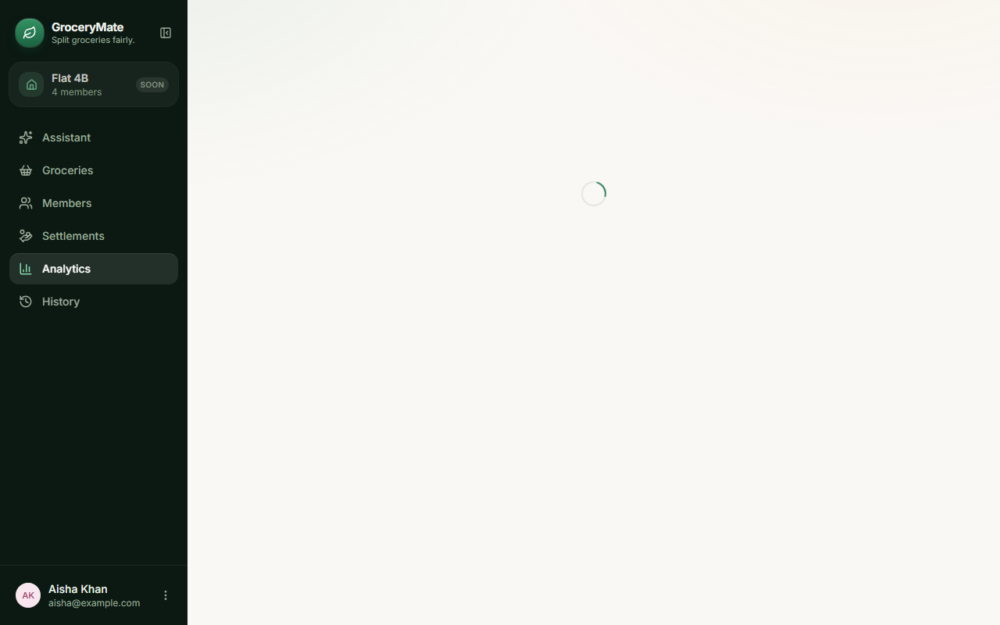
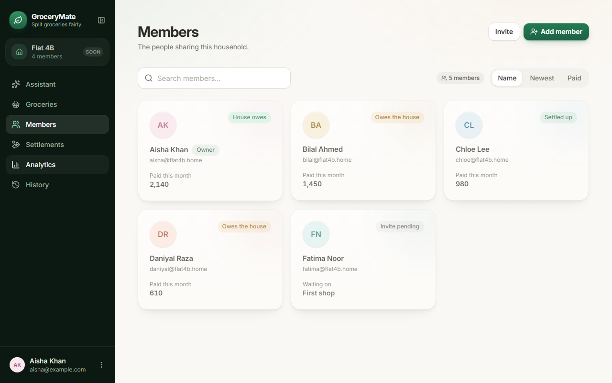
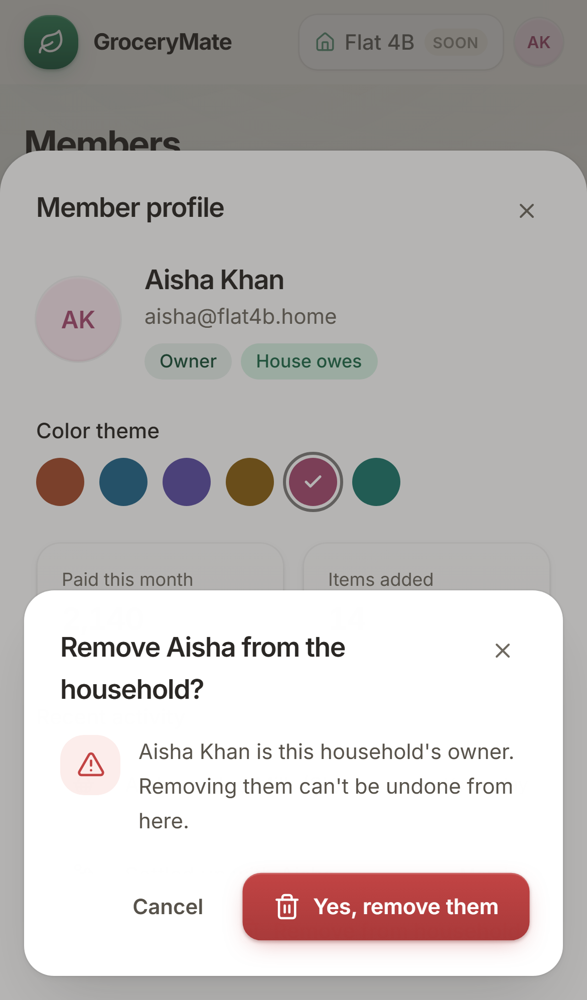
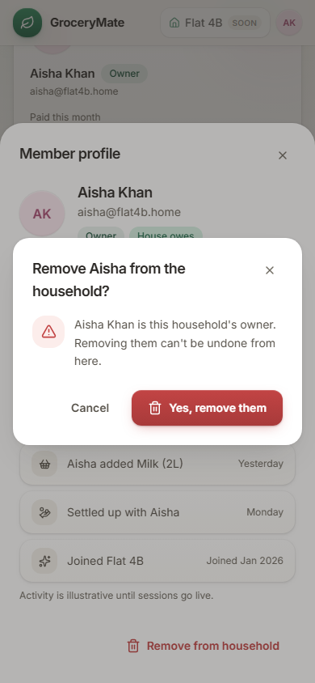
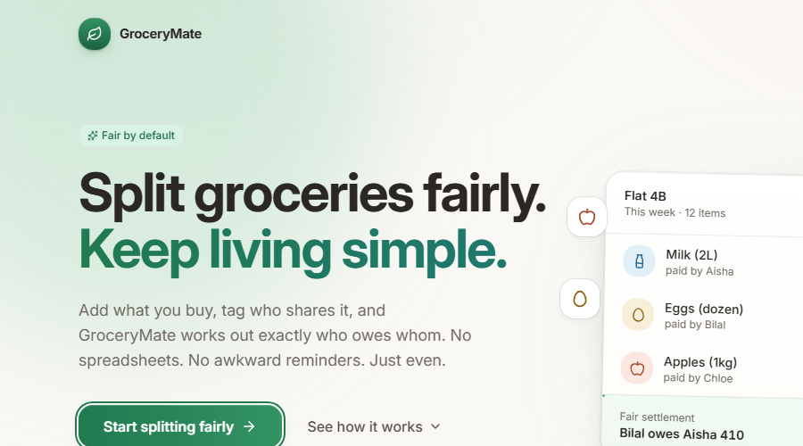
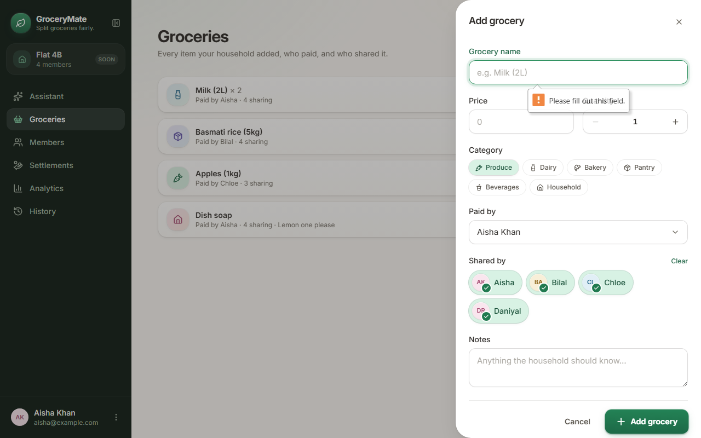
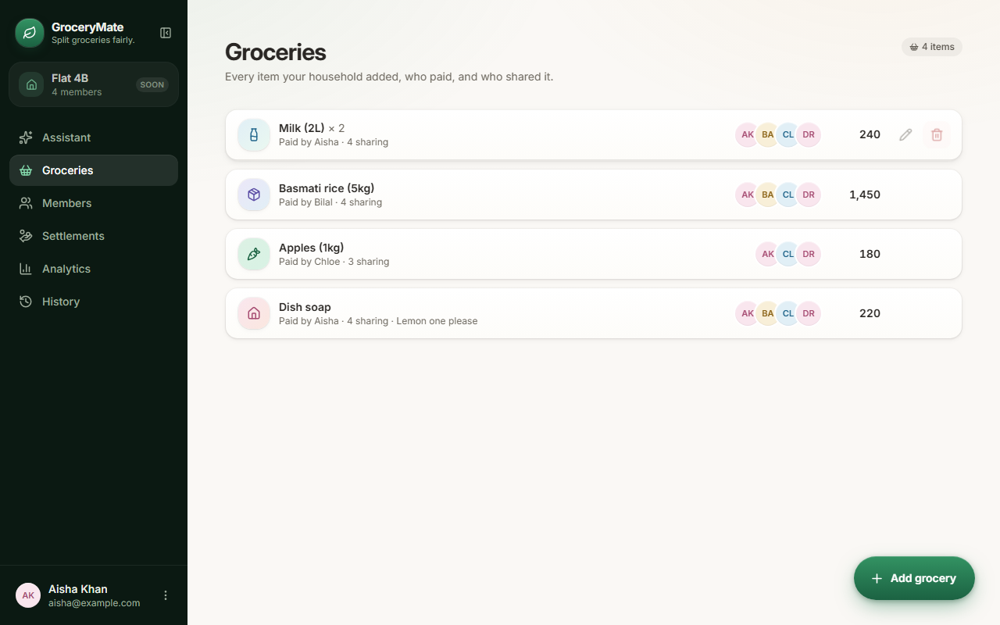
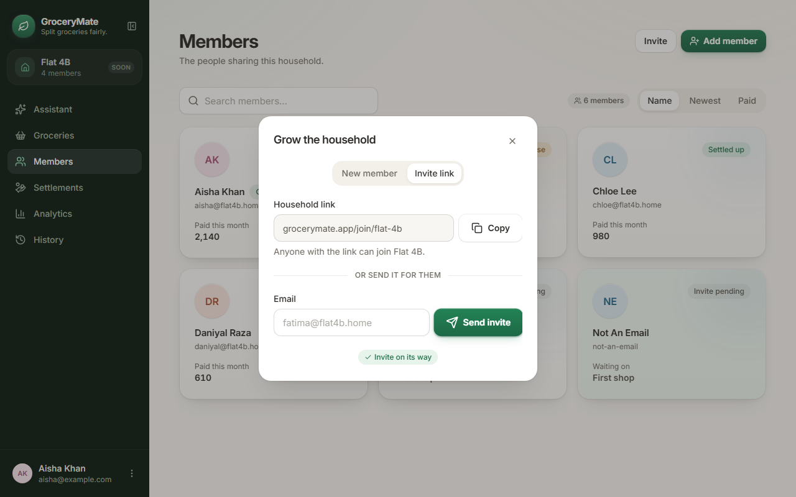
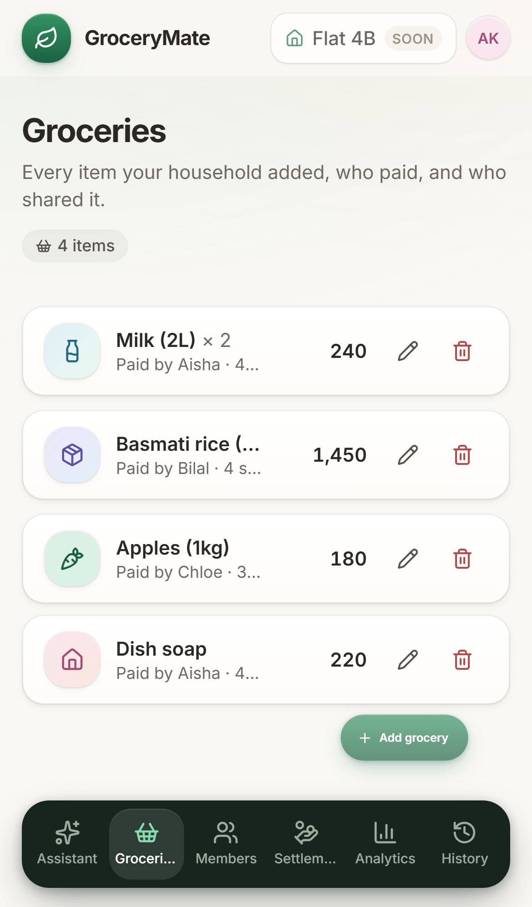
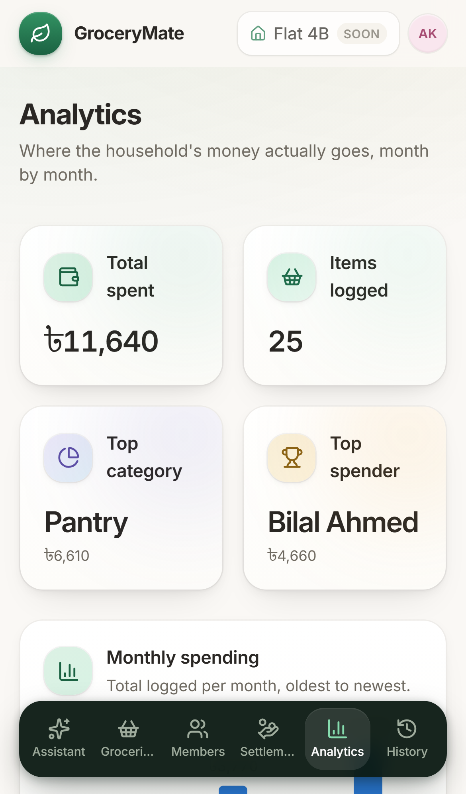

# GroceryMate — Exploratory UI/UX QA Audit

**Type:** Discovery audit (2026-08-23), plus a fix pass on the three approved High-severity defects (2026-08-24).
**Date:** 2026-08-23 (audit) / 2026-08-24 (fixes)
**Environment:** Local dev server (`npm run dev`, Vite, `http://localhost:5173/`)
**Tooling:** Playwright (Chromium), driven by a scripted interaction harness plus manual visual review of the resulting screenshots.
**Viewports tested:** Desktop (1280×800) and Mobile (390×844, iPhone 13 emulation, touch enabled).

## Scope notes (read before the findings)

- The app has **no URL routing** — everything renders under `/` and page switching is pure React state (`src/hooks/useAppNavigation.ts`). There is no "Overview" page id in the codebase; it was interpreted as **Analytics** for this audit (best label match — "Where the household's money actually goes"). Please confirm that mapping is what you intended.
- The nav also includes an **Assistant** page (AI grocery-list generator) that wasn't in the requested list — it was not tested. Flag if you'd like a follow-up pass on it.
- History's "Export all" button was not separately exercised; it calls the same `downloadTextFile` code path already verified via the single-session Export and the Settings "Export all data" button.
- 88 scripted interaction steps were run in total (44 per viewport) covering navigation, forms, dialogs, drawers, empty states, search/filter, keyboard (Tab/Escape), rapid-click, long text, invalid input, destructive actions, and browser back navigation. **Zero console errors or uncaught page errors** were observed in either run.

## Summary

| Severity | Count | Status |
|---|---|---|
| Critical | 0 | — |
| High | 3 | **All 3 fixed and verified (2026-08-24)** — QA-001, QA-002, QA-003 |
| Medium | 4 | Not in scope for this fix pass — untouched |
| Low | 2 | Not in scope for this fix pass — untouched |
| **Total defects** | **9** | |
| UX improvement suggestions | 7 | Not in scope for this fix pass — untouched |

**Remaining High-severity issues: 0.**

---

## Defects

### QA-001 — Browser/hardware back navigation exits the app to a blank page

**Status: FIXED and VERIFIED (2026-08-24)**

**Severity:** High
**Page:** All pages (architectural, not page-specific)
**Viewport:** Desktop and Mobile (both confirmed)

**Preconditions:** App entered past the Landing gate, at least one in-app navigation performed.

**Steps to reproduce:**
1. Open the app, click "Start splitting fairly."
2. Navigate to any page (e.g. Members, then Analytics).
3. Press the browser's Back button (or trigger `history.back()` — the same action a mobile back-gesture or hardware back button performs).

**Expected:** Back should step to the previous in-app page (e.g. from Analytics back to Members), matching how every other back button on the web/PWA behaves.

**Actual:** The browser navigates away from the app entirely to `about:blank` (a fully blank white page — screenshots below). All in-app state (current page, drawer/dialog state) is lost; the user is looking at an empty page with no way back except re-typing the URL or using Forward.

| Before | After pressing Back |
|---|---|
|  |  |

**Root cause:** `src/hooks/useAppNavigation.ts` manages `activePage` purely as React state — there is no `react-router`, no `history.pushState`, and no hash routing anywhere in `src`. The browser has no history entries for in-app pages, so Back falls through to whatever was in the tab's history before the single `/` load.

**User impact:** This is the single most consequential finding in the audit. Every page is affected. It is especially severe for the installed PWA use case (this app was built as an installable PWA per a prior session) — on mobile, back-gesture/back-button is a primary navigation idiom, and users will perceive the app as having crashed or lost their data when it dumps them onto a blank page.

**Suggested improvement:** Introduce real client-side routing (React Router, TanStack Router, or manual `history.pushState`/`popstate` wiring) so each page has a distinct history entry and Back/Forward move between them. This also unlocks deep-linking and bookmarkable/shareable URLs as a side benefit.

**Fix applied:** No routing library existed in the project (confirmed by inspecting `package.json`/`node_modules`), so `react-router-dom@7` was added — the standard, most-supported option, used only via its minimal API (`BrowserRouter`, `Routes`, `Route`, `useLocation`, `useNavigate`; no data-router/loader features). Each app page now has a real path (`/groceries`, `/members`, `/settlements`, `/analytics`, `/history`, `/settings`, `/assistant`), plus `/` for Landing. `useAppNavigation.ts` was rewritten to derive `activePage`/`direction`/`priorPage` from the router's location instead of local `useState`, while keeping its exact returned shape — so `App.tsx`'s consumers (`AppShell`, `Sidebar`, `BottomNav`, `TopBar`, `SettingsPage`) needed no changes at all. `App.tsx` now renders real `<Route>` elements (with a `<Route path="*">` redirect to `/groceries` for unrecognized paths), keeping the same two-layer Framer Motion `AnimatePresence` structure (Landing↔App fade, then page↔page slide) it had before — only the *source* of `entered`/`activePage` changed, not the animation code. `main.tsx` wraps the app in `<BrowserRouter>`.

*Files changed:* `src/main.tsx`, `src/App.tsx`, `src/hooks/useAppNavigation.ts`, `package.json`/`package-lock.json` (added `react-router-dom`).

*Verification:* Reproduction script re-run post-fix — `urlBeforeBack: "/analytics"` → Back → `urlAfterBack: "/members"` (the real previous page, `membersHeadingVisible: true`), instead of `about:blank`. Re-verified across all 4 required viewports (390×844, 430×932, 1366×768, 1440×900): mouse nav, browser Back, browser Forward, refresh-on-route, and direct-URL-open all confirmed working for every route, including `/assistant` (routable, previously untested). Invalid URLs redirect to `/groceries` instead of breaking. Zero console errors in any run. See screenshot below and the "Automated test results" section in the fix report for the full matrix.

---

### QA-002 — Nested confirm modal visually overlaps the Member Profile Drawer on mobile

**Status: FIXED and VERIFIED (2026-08-24)**

**Severity:** High
**Page:** Members (Member Profile Drawer → "Remove from household")
**Viewport:** Mobile only (390×844) — desktop renders this cleanly

**Preconditions:** At least one member exists in the household.

**Steps to reproduce:**
1. Go to Members, tap any member card to open the Member Profile Drawer.
2. Tap "Remove from household" (in the drawer's footer) to open the confirmation dialog.

**Expected:** The confirmation dialog should be clearly legible and visually distinct from the drawer behind it.

**Actual:** Both `Drawer` (`src/components/ui/Drawer.tsx`) and `Modal` (`src/components/ui/Modal.tsx`) anchor to the **bottom** of the screen on narrow viewports (Drawer via its `side="bottom"` prop, Modal via its `items-end` mobile layout). With one stacked inside the other, the confirmation modal's panel overlaps and visually cuts into the drawer's own content underneath it (the drawer's "Paid this month" / "Items added" stat tiles are visibly obscured/bled through behind the modal — see screenshot).

**User impact:** This happens on **every** attempt to remove a member on mobile — it's not an edge case. It looks broken/unpolished for a destructive, irreversible action ("can't be undone from here" is the dialog's own copy), which is exactly the moment a confused-looking UI is most costly.

**Suggested improvement:** When a `Modal` is opened while a `Drawer` is already open (or generally, any time a dialog is nested), the modal should render as a true overlay independent of viewport-width-based anchoring — e.g. always center the confirmation modal regardless of viewport, or use a different pattern for "confirm inside a drawer" (an inline confirmation state within the drawer itself, avoiding a second stacked overlay entirely).

**Fix applied:** Added an optional `alwaysCentered` prop to the shared `Modal` component (`src/components/ui/Modal.tsx`), defaulting to `false` so every other `Modal` usage in the app (the "Reset preferences?" confirm, the "Add member" dialog) keeps its existing bottom-sheet-on-mobile behavior unchanged. Only the one nested call site — the "Remove from household" confirmation inside `MemberProfileDrawer.tsx` — opts in. When set, the modal's outer container always uses `items-center` instead of `items-end sm:items-center`, so it can never compete with a bottom-anchored `Drawer` for the same screen edge. Confirmation protection itself (the two-step "open profile → Remove from household → confirm" flow, the owner-specific warning copy, Cancel/confirm buttons) is untouched. The separately-tracked Escape-closes-both-dialogs behavior (Medium, QA-007) was deliberately left as-is — this fix only changes *positioning*, not the Escape key handling.

*Files changed:* `src/components/ui/Modal.tsx`, `src/features/members/MemberProfileDrawer.tsx`.

*Verification:* Bounding-box measurement re-run post-fix on a 390×844 viewport: the confirmation modal is now perfectly centered (`centeringOffsetPx: 0`, modal vertical center exactly at the viewport's vertical center) with a 294px gap to the bottom of the screen (`isBottomAnchored: false`), versus being pinned to the bottom and overlapping the drawer by 256px before the fix. Re-checked at all 4 required viewports — centered and non-bottom-anchored at every one, including the two desktop sizes (1366×768, 1440×900), which already worked correctly and show no regression. Screenshot below confirms the drawer's content is now cleanly dimmed behind a single, unambiguous, centered dialog instead of a jagged double-bottom-sheet collision.

---

### QA-003 — Landing page's two primary CTAs have no effectively visible keyboard focus indicator

**Status: FIXED and VERIFIED (2026-08-24)** — see the "revised root cause" note below; the fix addresses a real, measured defect, but it's a more precise diagnosis than the original write-up.

**Severity:** High
**Page:** Landing
**Viewport:** Desktop (mechanism is CSS/DOM-based, not viewport-dependent — likely applies on mobile with an external keyboard too)

**Preconditions:** None — first page any user sees.

**Steps to reproduce:**
1. Load the app fresh (before entering).
2. Press Tab from the top of the page and inspect the focus ring on each stop.

**Expected:** Every interactive element should get a clearly visible focus ring when tabbed to (WCAG 2.4.7 Focus Visible), consistent with the "See how it works" link, which does render one correctly.

**Actual:** Verified via computed styles (not just visual inspection):
- **"Start splitting fairly"** (the hero CTA, `Button variant="primary"`): its `focus-visible:ring-2` class is present in the DOM, but the computed `box-shadow` on focus shows no distinct ring layer at all — only the button's normal resting-state shadow. No visible focus indicator renders.
- **"Open the app"** (header CTA, `Button variant="ghost"`): a ring layer is technically present but at `0.7px` spread and `~7%` opacity (`ring-brand-500/40` should be 40% opacity) — practically imperceptible.
- **"See how it works"** (a plain `<a>`, not the shared `Button` component): renders a proper, clearly visible 2px ring at 40% opacity.

**User impact:** Keyboard-only users (and anyone using switch access, or just tabbing through the page) cannot reliably see which of the two primary CTAs is focused before pressing Enter. On the very first page of the product, this is a meaningful accessibility barrier, and it's an AA conformance gap (WCAG 2.4.7).

**Suggested improvement:** The shared `Button` component (`src/components/ui/Button.tsx`) composes a decorative `shadow-button-brand`/gradient shadow together with the `focus-visible:ring-*` utility on the same `box-shadow` property; for the `primary` variant these appear to conflict so the ring doesn't render, and for `ghost` the ring opacity token isn't taking effect as authored. Recommend auditing all `Button` variants (primary, secondary, ghost, danger) for a consistently visible focus ring — this pattern is reused everywhere in the app, not just Landing, so it's worth checking Groceries/Members/Settlements primary actions too.

**Revised root cause (found while reproducing with Playwright before fixing):** The original diagnosis above was measured by reading computed styles immediately after a synthetic Tab keypress, with no settle delay. Sampling the same elements at increasing delays (0/30/60/100/150/200/300/600ms) showed the ring is **not actually absent** — both buttons' `box-shadow` is listed in their `transition` property (`transition-[...,box-shadow] duration-150` on `Button`, `transition-[background-position,box-shadow] duration-300` on the Landing hero CTA), so the ring fades in over ~150-300ms rather than snapping in instantly; at 0ms it reads as almost fully transparent, which is what the original audit captured. The **real, independently-confirmed defect** is contrast, not absence: computing the WCAG relative-luminance contrast of the ring color as actually rendered — `ring-brand-500/40` (ghost) and `ring-brand-500/50` (primary/hero) against the `canvas` background (`#faf8f5`) — gives **~1.6:1 and ~1.8:1**, both well under the **3:1 minimum required by WCAG 1.4.11** (Non-text Contrast) for UI-component focus indicators. So even once fully faded in, the ring was too faint to reliably read as "focused," and the transition delay made a fast keyboard tab-through look like it had no indicator at all.

**Fix applied:** In `Button.tsx`, all four variants' focus ring color changed from a translucent `ring-brand-500/40` or `/50` (and `ring-danger-500/40` for `danger`) to the design system's own existing "AA-safe" shade at full opacity — `ring-brand-600` / `ring-danger-600` — the same 600-step tokens the codebase already uses elsewhere specifically for accessible contrast (see the existing comment above `variantClasses` about button-label contrast). This computes to **~5.0:1** (brand-600) and **~4.7:1** (danger-600) against `canvas`, comfortably clearing 3:1. `box-shadow` was also removed from the button's transitioned properties, so the ring now appears immediately on focus instead of fading in. The Landing page's `HeroCta` (a bespoke component, not the shared `Button`) got the equivalent fix directly — solid `ring-brand-600`, `box-shadow` no longer transitioned — since replacing it with the generic `Button` would have meant losing its distinct gradient/lift treatment, which felt like a bigger visual change than this fix warranted. The `Button` fix alone applies app-wide, wherever the shared component is used.

*Files changed:* `src/components/ui/Button.tsx`, `src/features/landing/Landing.tsx`.

*Note on remaining scope:* The "See how it works" link on Landing (a plain `<a>`, not the shared `Button` or `HeroCta`) uses the same low-contrast `ring-brand-500/40` pattern and would measure the same ~1.6:1 — but it isn't one of the "two primary CTAs" this defect named, so it was left as-is to keep this fix scoped to the approved item. Worth a follow-up if you want full consistency.

*Verification:* Re-sampled computed `box-shadow` at delay 0ms post-fix: both buttons now show a solid `rgb(33, 122, 80)` (brand-600) ring at full strength immediately, with no fade-in — confirmed stable at 0ms/300ms/600ms samples. Re-checked at all 4 required viewports: `openAppHasVisibleRing: true` and `heroCtaHasVisibleRing: true` in every case. Screenshot below shows the rendered ring.

---

### QA-004 — GroceryForm's native HTML5 validation suppresses the app's own custom validation UI

**Severity:** Medium
**Page:** Groceries → "Add grocery" drawer
**Viewport:** Desktop and Mobile (identical behavior both)

**Preconditions:** Open the Add/Edit grocery drawer.

**Steps to reproduce:**
1. Open Groceries, tap "Add grocery."
2. Leave "Grocery name" empty, click "Add grocery" (submit) without filling anything.

**Expected:** The app's own styled inline error — "Enter a name for this item." (present in the component's code, `GroceryForm.tsx:78`) — should appear below the field, matching the pattern used everywhere else in the app (e.g. the Members "Add member" dialog, which shows this correctly).

**Actual:** Because the "Grocery name" `<Input required>` sits inside a real `<form>`, the browser's own native validation intercepts submission first. The user sees only the browser's default tooltip ("Please fill out this field.") — an unstyled, browser-chrome UI element that clashes with the app's fully custom design system. The form's `onSubmit` handler (and therefore the custom red error text) never runs, because the native constraint validation blocks it. As a side effect, the browser auto-scrolls the drawer's content to bring the invalid field into view, which pushes the "Live preview" grocery card above the fold, out of sight.

**User impact:** Inconsistent, unpolished validation experience specifically on this one form; the styling clash is jarring in an otherwise fully custom UI, and its exact appearance/position varies by browser (Chromium shows this tooltip; Firefox styles it differently; Safari's default behavior differs again).

**Suggested improvement:** Add `noValidate` to the `<form>` in `GroceryForm.tsx` (the codebase already has working custom validation logic sitting right next to the native `required` attribute — it just never gets a chance to run) so the existing `nameError`/`sharedByError` messaging always fires, matching the Members dialog's behavior.

---

### QA-005 — Deleting a grocery item requires zero confirmation

**Severity:** Medium
**Page:** Groceries
**Viewport:** Desktop and Mobile (identical)

**Preconditions:** At least one grocery item exists.

**Steps to reproduce:**
1. Go to Groceries.
2. Click/tap the trash icon on any item.

**Expected:** Given this is a shared-expense tracker where one person's mistaken delete affects everyone else's math, and given the app *does* guard the equivalent destructive action elsewhere (removing a member requires a confirm dialog with explicit "can't be undone" copy), grocery deletion should arguably carry the same guard, or at minimum an undo affordance.

**Actual:** Clicking delete removes the item immediately and irreversibly — no confirmation dialog, no undo toast, no snackbar.

**User impact:** A stray click/tap (easy to imagine on the mobile FAB-and-icon-row layout, where the edit and delete icons sit right next to each other) permanently removes a shared grocery entry with no recovery path. Currently low real-world blast radius since data is mock/session-only, but the inconsistency with the Members flow suggests this wasn't a deliberate product decision so much as an oversight.

**Suggested improvement:** Either add a lightweight confirm step (matching Members), or add an "Undo" snackbar for a few seconds after delete — cheaper on the interaction cost than a modal, while still preventing accidental data loss.

---

### QA-006 — Invite-by-email accepts any string, creating a garbage member record

**Severity:** Medium
**Page:** Members → "Add member" dialog → "Invite link" tab
**Viewport:** Desktop and Mobile (identical)

**Preconditions:** Open the Add Member dialog.

**Steps to reproduce:**
1. Members → "Add member" → switch to the "Invite link" tab.
2. Type `not-an-email` into the Email field (any non-empty string works).
3. Click "Send invite."

**Expected:** Either a format-level validation error, or at minimum a graceful handling of unrecognized email formats.

**Actual:** The invite is accepted outright — the app shows a success "Invite on its way" toast, **and** a new member card is created using the literal invalid string, displayed as a member named **"Not An Email"** with **"not-an-email"** as its subtitle and an "Invite pending" badge. This isn't just a transient toast — it's a persistent, visibly nonsensical entry in the household's member list.

**User impact:** Any typo in an invite email silently produces bad, visible data in a shared list everyone in the household sees, with no way to tell from the UI that anything went wrong.

**Suggested improvement:** Add basic email-format validation (a simple regex is sufficient) to the invite field, matching the "required" check that's already there for the name field in the same dialog.

---

### QA-007 — Escape key closes both a confirm modal and its parent drawer simultaneously

**Severity:** Medium
**Page:** Members → Member Profile Drawer → "Remove from household"
**Viewport:** Desktop and Mobile (identical; the visual overlap in QA-002 is mobile-only, but this Escape behavior reproduces on desktop too, where the two dialogs are visually well-separated)

**Preconditions:** Member Profile Drawer open, confirmation modal open on top of it.

**Steps to reproduce:**
1. Members → open any member's profile drawer.
2. Click "Remove from household" to open the confirm modal.
3. Press Escape once.

**Expected:** Escape should close only the top-most dialog (the confirm modal), leaving the profile drawer open underneath — standard modal-stacking behavior.

**Actual:** Both the confirm modal **and** the profile drawer close at once, from a single Escape press. Verified directly: `confirmModalWasVisible=true` → after one Escape → `confirmStillVisible=false, drawerStillVisible=false`.

**Root cause:** Both `Modal` and `Drawer` (`src/components/ui/Modal.tsx` / `Drawer.tsx`) independently register their own `document`-level `keydown` listener for Escape, each unconditionally calling its own `onClose`. Neither is aware the other is open, and neither stops propagation, so one keypress triggers both handlers.

(Tab-key focus trapping was also checked in this same nested scenario — that part works correctly; Tab only cycled through the modal's own 3 focusable elements and did not leak into the drawer behind it. The bug is specific to the Escape-key handling.)

**User impact:** A user who presses Escape intending to back out of just the confirmation ("actually, don't remove them, let me look at their profile again") instead gets dropped all the way back to the Members list, which is a small but real surprise in an otherwise polished interaction.

**Suggested improvement:** Track dialog stacking (e.g. a simple shared stack/context of open dialogs) so Escape only closes the top-most one, or have nested dialogs check "is a deeper dialog than me currently open" before acting on their own Escape handler.

---

### QA-008 — Bottom nav item labels visually truncate on mobile

**Severity:** Low
**Page:** All pages (persistent app chrome)
**Viewport:** Mobile (390px) only

**Preconditions:** None.

**Steps to reproduce:** Enter the app on a 390px-wide viewport and look at the floating bottom nav dock.

**Expected:** All six nav labels (Assistant, Groceries, Members, Settlements, Analytics, History) fully legible.

**Actual:** "Groceries" renders as "Groceri…" and "Settlements" as "Settlem…" on every page, consistently.

**User impact:** Low — the icon plus partial label is still enough to navigate confidently once learned, and this is purely a visual (CSS `truncate`) effect: the full label text is still in the DOM, so screen reader/accessible-name users are unaffected.

**Suggested improvement:** Either drop text labels at this breakpoint in favor of icon-only with a tooltip/long-press label, shorten the labels ("Settle" instead of "Settlements"), or move to a horizontally scrollable dock if all 6 items with full labels must stay.

---

### QA-009 — Floating bottom nav dock has a gap where scrollable page content peeks through

**Severity:** Low
**Page:** Analytics (observed here; likely reproducible on any sufficiently tall page)
**Viewport:** Mobile only

**Preconditions:** A page with content extending well past one viewport height (Analytics' charts).

**Steps to reproduce:** Open Analytics on mobile and look at the strip directly below the floating bottom nav dock, at the very bottom edge of the screen.

**Expected:** Nothing but background visible below the dock.

**Actual:** Small fragments of the underlying "Monthly spending" bar chart are visible peeking through in the ~14px gap between the dock's bottom edge and the true screen edge (`BottomNav.tsx` positions the dock with `bottom: calc(0.875rem + safe-area-inset-bottom)`, leaving that strip uncovered).

**User impact:** Minor cosmetic polish issue — a thin sliver of unrelated content visible under a floating chrome element. Doesn't block any interaction.

**Suggested improvement:** Either give the scrollable content container enough bottom padding/mask so nothing renders in that gap, or fade/mask the strip directly behind the dock.

---

## UX Improvement Suggestions (not defects)

These are recommendations, not bugs — nothing here is broken today.

1. **UX-001 — Undo for grocery deletion.** Pairs with QA-005: even a simple "Item removed · Undo" snackbar would meaningfully reduce the risk from having no confirm step.
2. **UX-002 — Real email validation on invites.** Pairs with QA-006: a basic format check on top of the existing "required" check.
3. **UX-003 — Client-side routing.** The root fix for QA-001; also unlocks deep-linking and shareable/bookmarkable URLs, which matters more given this is an installable PWA.
4. **UX-004 — Audit all `Button` variants for the focus-ring rendering issue.** QA-003 was confirmed on Landing specifically, but the same `Button` component (and its shadow/ring composition) is reused for primary actions across Groceries, Members, Settlements, etc. — worth a full sweep rather than assuming it's Landing-only.
5. **UX-005 — Nested-interactive-element cleanup.** `HistoryCard` and `MemberCard` render a real `<button>` (Export, in HistoryCard's case) inside an outer `role="button"` `Card`. It works correctly today (keyboard and mouse both tested), but nesting one interactive element inside another is a discouraged ARIA pattern worth simplifying if these components are touched again.
6. **UX-006 — Reconsider the 6-item mobile bottom nav density.** Root-cause fix for QA-008 beyond just shortening labels — e.g. a "More" overflow item, or moving Analytics/Settlements behind a secondary surface on the smallest screens.
7. **UX-007 — Follow-up pass on the Assistant page.** It exists in the nav and wasn't part of this audit's requested scope; recommend a dedicated pass if it's in active use.

---

## Positive findings (for balance)

- **Zero console/page errors** across all 88 scripted interaction steps (both viewports).
- **No horizontal overflow** detected on any of the 7 pages at either viewport width.
- Rapid repeated clicks were tested on the grocery-add submit button, the settlement "Mark as paid" action, and rapid nav-item switching — **no duplicate submissions, no stuck states, no errors** in any case. The settle button's internal state guard and the drawer's close-on-submit both work as intended under stress.
- Empty states (Groceries, Members, History, and the "no search/filter results" sub-states) are well-designed, clearly worded, and each offers a relevant next action.
- The Member-removal confirmation dialog's copy is a good example of careful UX writing (it calls out the owner case specifically: "is this household's owner. Removing them can't be undone from here").
- Settings honestly discloses which controls aren't wired up yet ("saved here, but not yet applied to the app — coming soon" for Appearance; similar copy for Preferences) rather than silently no-op'ing, which avoids user confusion about Dark Mode/Theme/Currency/Language not visibly doing anything yet.
- Price-field input masking (`GroceryForm`) correctly rejects letters/negative signs and truncates to 2 decimals under direct typing pressure.
- Feedback form correctly disables Send for empty and whitespace-only input, not just empty.
