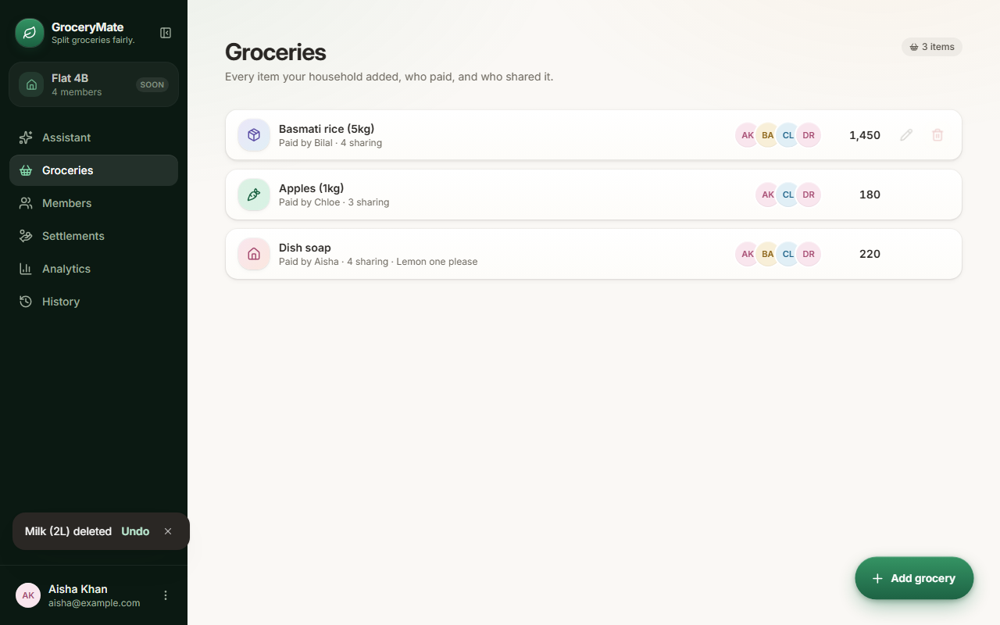
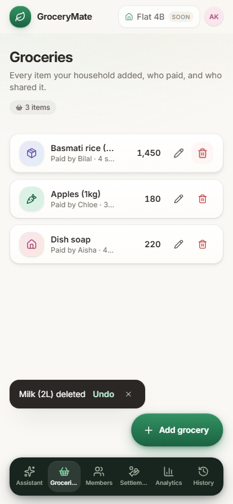
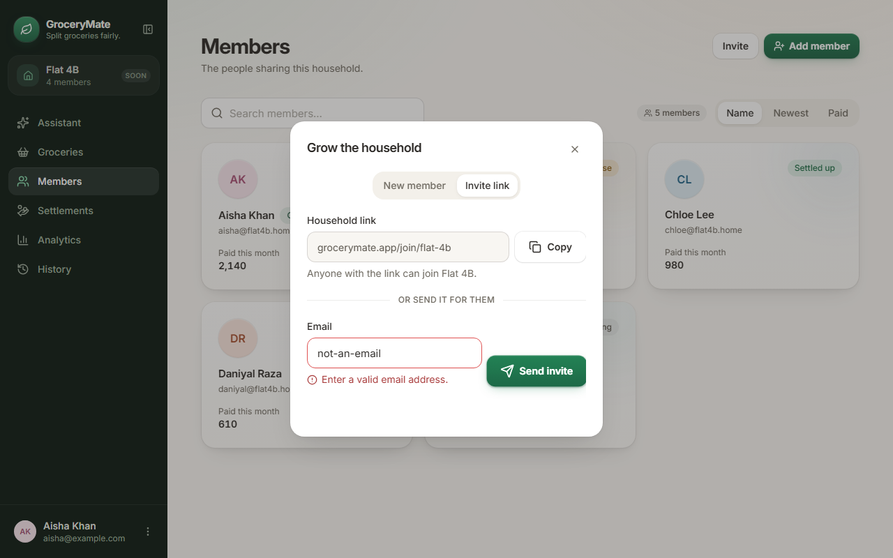
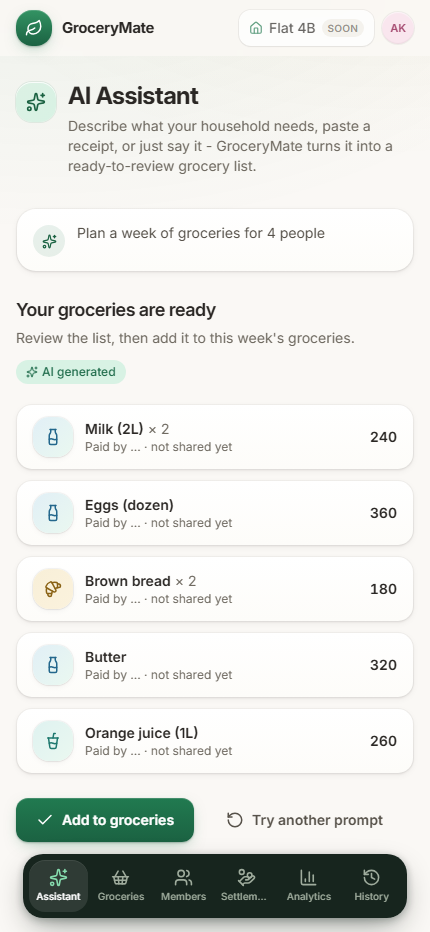
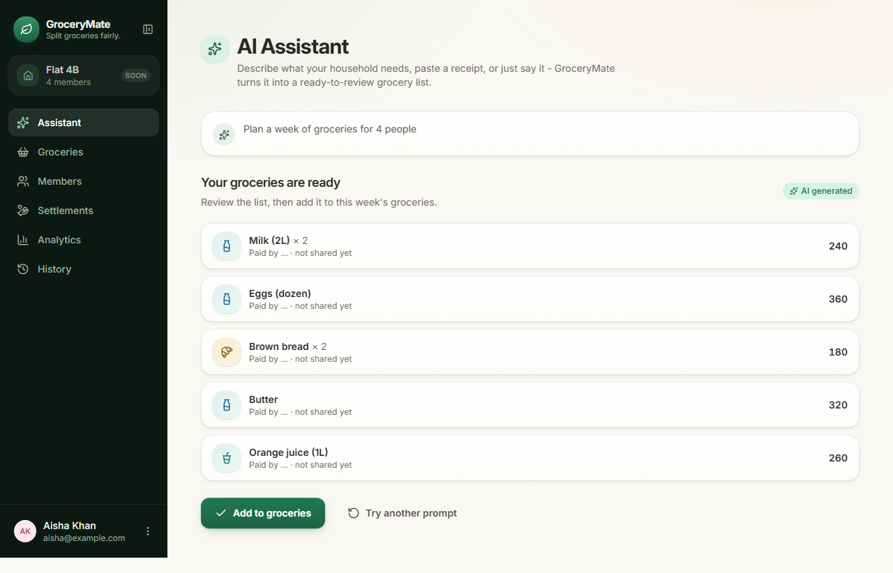
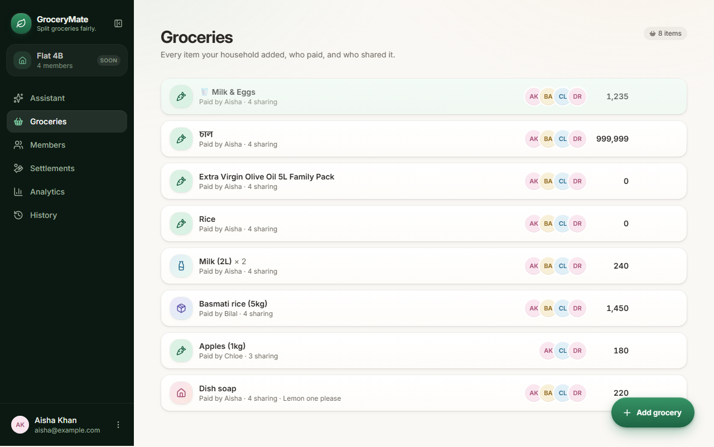

# GroceryMate — Exploratory UI/UX QA Audit

**Type:** Discovery audit (2026-08-23), a fix pass on the three approved High-severity defects (2026-08-24), and a fix pass on the four approved Medium-severity defects plus one accessibility follow-up (2026-08-25).
**Date:** 2026-08-23 (audit) / 2026-08-24 (High fixes) / 2026-08-25 (Medium fixes)
**Environment:** Local dev server (`npm run dev`, Vite, `http://localhost:5173/`)
**Tooling:** Playwright (Chromium), driven by a scripted interaction harness plus manual visual review of the resulting screenshots.
**Viewports tested:** Desktop (1280×800) and Mobile (390×844, iPhone 13 emulation, touch enabled).

## Scope notes (read before the findings)

- The app has **no URL routing** — everything renders under `/` and page switching is pure React state (`src/hooks/useAppNavigation.ts`). There is no "Overview" page id in the codebase; it was interpreted as **Analytics** for this audit (best label match — "Where the household's money actually goes"). Please confirm that mapping is what you intended.
- The nav also includes an **Assistant** page (AI grocery-list generator) that wasn't in the requested list — it was not tested. Flag if you'd like a follow-up pass on it.
- History's "Export all" button was not separately exercised; it calls the same `downloadTextFile` code path already verified via the single-session Export and the Settings "Export all data" button.
- 88 scripted interaction steps were run in total (44 per viewport) covering navigation, forms, dialogs, drawers, empty states, search/filter, keyboard (Tab/Escape), rapid-click, long text, invalid input, destructive actions, and browser back navigation. **Zero console errors or uncaught page errors** were observed in either run.

## Summary

| Severity | Count | Status |
|---|---|---|
| Critical | 0 | — |
| High | 3 | **All 3 fixed and verified (2026-08-24)** — QA-001, QA-002, QA-003 |
| Medium | 4 | **All 4 fixed and verified (2026-08-25)** — QA-004, QA-005, QA-006, QA-007 |
| Low | 2 | Not in scope for this fix pass — untouched |
| **Total defects** | **9** | |
| UX improvement suggestions | 7 | Not in scope for either fix pass — untouched (UX-001 and UX-002 are effectively addressed as a side effect of the QA-005/QA-006 fixes below, but weren't separately re-reviewed as standalone suggestions) |

**Remaining High-severity issues: 0. Remaining Medium-severity issues: 0.**

---

## Defects

### QA-001 — Browser/hardware back navigation exits the app to a blank page

**Status: FIXED and VERIFIED (2026-08-24)**

**Severity:** High
**Page:** All pages (architectural, not page-specific)
**Viewport:** Desktop and Mobile (both confirmed)

**Preconditions:** App entered past the Landing gate, at least one in-app navigation performed.

**Steps to reproduce:**
1. Open the app, click "Start splitting fairly."
2. Navigate to any page (e.g. Members, then Analytics).
3. Press the browser's Back button (or trigger `history.back()` — the same action a mobile back-gesture or hardware back button performs).

**Expected:** Back should step to the previous in-app page (e.g. from Analytics back to Members), matching how every other back button on the web/PWA behaves.

**Actual:** The browser navigates away from the app entirely to `about:blank` (a fully blank white page — screenshots below). All in-app state (current page, drawer/dialog state) is lost; the user is looking at an empty page with no way back except re-typing the URL or using Forward.

| Before | After pressing Back |
|---|---|
|  |  |

**Root cause:** `src/hooks/useAppNavigation.ts` manages `activePage` purely as React state — there is no `react-router`, no `history.pushState`, and no hash routing anywhere in `src`. The browser has no history entries for in-app pages, so Back falls through to whatever was in the tab's history before the single `/` load.

**User impact:** This is the single most consequential finding in the audit. Every page is affected. It is especially severe for the installed PWA use case (this app was built as an installable PWA per a prior session) — on mobile, back-gesture/back-button is a primary navigation idiom, and users will perceive the app as having crashed or lost their data when it dumps them onto a blank page.

**Suggested improvement:** Introduce real client-side routing (React Router, TanStack Router, or manual `history.pushState`/`popstate` wiring) so each page has a distinct history entry and Back/Forward move between them. This also unlocks deep-linking and bookmarkable/shareable URLs as a side benefit.

**Fix applied:** No routing library existed in the project (confirmed by inspecting `package.json`/`node_modules`), so `react-router-dom@7` was added — the standard, most-supported option, used only via its minimal API (`BrowserRouter`, `Routes`, `Route`, `useLocation`, `useNavigate`; no data-router/loader features). Each app page now has a real path (`/groceries`, `/members`, `/settlements`, `/analytics`, `/history`, `/settings`, `/assistant`), plus `/` for Landing. `useAppNavigation.ts` was rewritten to derive `activePage`/`direction`/`priorPage` from the router's location instead of local `useState`, while keeping its exact returned shape — so `App.tsx`'s consumers (`AppShell`, `Sidebar`, `BottomNav`, `TopBar`, `SettingsPage`) needed no changes at all. `App.tsx` now renders real `<Route>` elements (with a `<Route path="*">` redirect to `/groceries` for unrecognized paths), keeping the same two-layer Framer Motion `AnimatePresence` structure (Landing↔App fade, then page↔page slide) it had before — only the *source* of `entered`/`activePage` changed, not the animation code. `main.tsx` wraps the app in `<BrowserRouter>`.

*Files changed:* `src/main.tsx`, `src/App.tsx`, `src/hooks/useAppNavigation.ts`, `package.json`/`package-lock.json` (added `react-router-dom`).

*Verification:* Reproduction script re-run post-fix — `urlBeforeBack: "/analytics"` → Back → `urlAfterBack: "/members"` (the real previous page, `membersHeadingVisible: true`), instead of `about:blank`. Re-verified across all 4 required viewports (390×844, 430×932, 1366×768, 1440×900): mouse nav, browser Back, browser Forward, refresh-on-route, and direct-URL-open all confirmed working for every route, including `/assistant` (routable, previously untested). Invalid URLs redirect to `/groceries` instead of breaking. Zero console errors in any run. See screenshot below and the "Automated test results" section in the fix report for the full matrix.

---

### QA-002 — Nested confirm modal visually overlaps the Member Profile Drawer on mobile

**Status: FIXED and VERIFIED (2026-08-24)**

**Severity:** High
**Page:** Members (Member Profile Drawer → "Remove from household")
**Viewport:** Mobile only (390×844) — desktop renders this cleanly

**Preconditions:** At least one member exists in the household.

**Steps to reproduce:**
1. Go to Members, tap any member card to open the Member Profile Drawer.
2. Tap "Remove from household" (in the drawer's footer) to open the confirmation dialog.

**Expected:** The confirmation dialog should be clearly legible and visually distinct from the drawer behind it.

**Actual:** Both `Drawer` (`src/components/ui/Drawer.tsx`) and `Modal` (`src/components/ui/Modal.tsx`) anchor to the **bottom** of the screen on narrow viewports (Drawer via its `side="bottom"` prop, Modal via its `items-end` mobile layout). With one stacked inside the other, the confirmation modal's panel overlaps and visually cuts into the drawer's own content underneath it (the drawer's "Paid this month" / "Items added" stat tiles are visibly obscured/bled through behind the modal — see screenshot).

**User impact:** This happens on **every** attempt to remove a member on mobile — it's not an edge case. It looks broken/unpolished for a destructive, irreversible action ("can't be undone from here" is the dialog's own copy), which is exactly the moment a confused-looking UI is most costly.

**Suggested improvement:** When a `Modal` is opened while a `Drawer` is already open (or generally, any time a dialog is nested), the modal should render as a true overlay independent of viewport-width-based anchoring — e.g. always center the confirmation modal regardless of viewport, or use a different pattern for "confirm inside a drawer" (an inline confirmation state within the drawer itself, avoiding a second stacked overlay entirely).

**Fix applied:** Added an optional `alwaysCentered` prop to the shared `Modal` component (`src/components/ui/Modal.tsx`), defaulting to `false` so every other `Modal` usage in the app (the "Reset preferences?" confirm, the "Add member" dialog) keeps its existing bottom-sheet-on-mobile behavior unchanged. Only the one nested call site — the "Remove from household" confirmation inside `MemberProfileDrawer.tsx` — opts in. When set, the modal's outer container always uses `items-center` instead of `items-end sm:items-center`, so it can never compete with a bottom-anchored `Drawer` for the same screen edge. Confirmation protection itself (the two-step "open profile → Remove from household → confirm" flow, the owner-specific warning copy, Cancel/confirm buttons) is untouched. The separately-tracked Escape-closes-both-dialogs behavior (Medium, QA-007) was deliberately left as-is — this fix only changes *positioning*, not the Escape key handling.

*Files changed:* `src/components/ui/Modal.tsx`, `src/features/members/MemberProfileDrawer.tsx`.

*Verification:* Bounding-box measurement re-run post-fix on a 390×844 viewport: the confirmation modal is now perfectly centered (`centeringOffsetPx: 0`, modal vertical center exactly at the viewport's vertical center) with a 294px gap to the bottom of the screen (`isBottomAnchored: false`), versus being pinned to the bottom and overlapping the drawer by 256px before the fix. Re-checked at all 4 required viewports — centered and non-bottom-anchored at every one, including the two desktop sizes (1366×768, 1440×900), which already worked correctly and show no regression. Screenshot below confirms the drawer's content is now cleanly dimmed behind a single, unambiguous, centered dialog instead of a jagged double-bottom-sheet collision.

---

### QA-003 — Landing page's two primary CTAs have no effectively visible keyboard focus indicator

**Status: FIXED and VERIFIED (2026-08-24)** — see the "revised root cause" note below; the fix addresses a real, measured defect, but it's a more precise diagnosis than the original write-up.

**Severity:** High
**Page:** Landing
**Viewport:** Desktop (mechanism is CSS/DOM-based, not viewport-dependent — likely applies on mobile with an external keyboard too)

**Preconditions:** None — first page any user sees.

**Steps to reproduce:**
1. Load the app fresh (before entering).
2. Press Tab from the top of the page and inspect the focus ring on each stop.

**Expected:** Every interactive element should get a clearly visible focus ring when tabbed to (WCAG 2.4.7 Focus Visible), consistent with the "See how it works" link, which does render one correctly.

**Actual:** Verified via computed styles (not just visual inspection):
- **"Start splitting fairly"** (the hero CTA, `Button variant="primary"`): its `focus-visible:ring-2` class is present in the DOM, but the computed `box-shadow` on focus shows no distinct ring layer at all — only the button's normal resting-state shadow. No visible focus indicator renders.
- **"Open the app"** (header CTA, `Button variant="ghost"`): a ring layer is technically present but at `0.7px` spread and `~7%` opacity (`ring-brand-500/40` should be 40% opacity) — practically imperceptible.
- **"See how it works"** (a plain `<a>`, not the shared `Button` component): renders a proper, clearly visible 2px ring at 40% opacity.

**User impact:** Keyboard-only users (and anyone using switch access, or just tabbing through the page) cannot reliably see which of the two primary CTAs is focused before pressing Enter. On the very first page of the product, this is a meaningful accessibility barrier, and it's an AA conformance gap (WCAG 2.4.7).

**Suggested improvement:** The shared `Button` component (`src/components/ui/Button.tsx`) composes a decorative `shadow-button-brand`/gradient shadow together with the `focus-visible:ring-*` utility on the same `box-shadow` property; for the `primary` variant these appear to conflict so the ring doesn't render, and for `ghost` the ring opacity token isn't taking effect as authored. Recommend auditing all `Button` variants (primary, secondary, ghost, danger) for a consistently visible focus ring — this pattern is reused everywhere in the app, not just Landing, so it's worth checking Groceries/Members/Settlements primary actions too.

**Revised root cause (found while reproducing with Playwright before fixing):** The original diagnosis above was measured by reading computed styles immediately after a synthetic Tab keypress, with no settle delay. Sampling the same elements at increasing delays (0/30/60/100/150/200/300/600ms) showed the ring is **not actually absent** — both buttons' `box-shadow` is listed in their `transition` property (`transition-[...,box-shadow] duration-150` on `Button`, `transition-[background-position,box-shadow] duration-300` on the Landing hero CTA), so the ring fades in over ~150-300ms rather than snapping in instantly; at 0ms it reads as almost fully transparent, which is what the original audit captured. The **real, independently-confirmed defect** is contrast, not absence: computing the WCAG relative-luminance contrast of the ring color as actually rendered — `ring-brand-500/40` (ghost) and `ring-brand-500/50` (primary/hero) against the `canvas` background (`#faf8f5`) — gives **~1.6:1 and ~1.8:1**, both well under the **3:1 minimum required by WCAG 1.4.11** (Non-text Contrast) for UI-component focus indicators. So even once fully faded in, the ring was too faint to reliably read as "focused," and the transition delay made a fast keyboard tab-through look like it had no indicator at all.

**Fix applied:** In `Button.tsx`, all four variants' focus ring color changed from a translucent `ring-brand-500/40` or `/50` (and `ring-danger-500/40` for `danger`) to the design system's own existing "AA-safe" shade at full opacity — `ring-brand-600` / `ring-danger-600` — the same 600-step tokens the codebase already uses elsewhere specifically for accessible contrast (see the existing comment above `variantClasses` about button-label contrast). This computes to **~5.0:1** (brand-600) and **~4.7:1** (danger-600) against `canvas`, comfortably clearing 3:1. `box-shadow` was also removed from the button's transitioned properties, so the ring now appears immediately on focus instead of fading in. The Landing page's `HeroCta` (a bespoke component, not the shared `Button`) got the equivalent fix directly — solid `ring-brand-600`, `box-shadow` no longer transitioned — since replacing it with the generic `Button` would have meant losing its distinct gradient/lift treatment, which felt like a bigger visual change than this fix warranted. The `Button` fix alone applies app-wide, wherever the shared component is used.

*Files changed:* `src/components/ui/Button.tsx`, `src/features/landing/Landing.tsx`.

*Note on remaining scope (resolved 2026-08-25):* The "See how it works" link was flagged here as using the same low-contrast pattern without being one of the two named CTAs, so it was left alone at the time. As part of the 2026-08-25 Medium-severity fix pass, it was folded into the same accessibility cleanup: its `focus-visible:ring-brand-500/40` became `focus-visible:ring-brand-600` (`src/features/landing/Landing.tsx`) — the same solid, ~5:1-contrast token used everywhere else, a one-class-value change with no other change to the control (it never had the box-shadow-transition timing issue the other two CTAs had, since its `transition-colors` doesn't include `box-shadow`, so only the color needed correcting). Re-verified at all 4 required viewports: renders a solid, immediate ring identical in treatment to the other two CTAs.

*Verification:* Re-sampled computed `box-shadow` at delay 0ms post-fix: both buttons now show a solid `rgb(33, 122, 80)` (brand-600) ring at full strength immediately, with no fade-in — confirmed stable at 0ms/300ms/600ms samples. Re-checked at all 4 required viewports: `openAppHasVisibleRing: true` and `heroCtaHasVisibleRing: true` in every case. Screenshot below shows the rendered ring.

---

### QA-004 — GroceryForm's native HTML5 validation suppresses the app's own custom validation UI

**Status: FIXED and VERIFIED (2026-08-25)**

**Severity:** Medium
**Page:** Groceries → "Add grocery" drawer
**Viewport:** Desktop and Mobile (identical behavior both)

**Preconditions:** Open the Add/Edit grocery drawer.

**Steps to reproduce:**
1. Open Groceries, tap "Add grocery."
2. Leave "Grocery name" empty, click "Add grocery" (submit) without filling anything.

**Expected:** The app's own styled inline error — "Enter a name for this item." (present in the component's code, `GroceryForm.tsx:78`) — should appear below the field, matching the pattern used everywhere else in the app (e.g. the Members "Add member" dialog, which shows this correctly).

**Actual:** Because the "Grocery name" `<Input required>` sits inside a real `<form>`, the browser's own native validation intercepts submission first. The user sees only the browser's default tooltip ("Please fill out this field.") — an unstyled, browser-chrome UI element that clashes with the app's fully custom design system. The form's `onSubmit` handler (and therefore the custom red error text) never runs, because the native constraint validation blocks it. As a side effect, the browser auto-scrolls the drawer's content to bring the invalid field into view, which pushes the "Live preview" grocery card above the fold, out of sight.

**User impact:** Inconsistent, unpolished validation experience specifically on this one form; the styling clash is jarring in an otherwise fully custom UI, and its exact appearance/position varies by browser (Chromium shows this tooltip; Firefox styles it differently; Safari's default behavior differs again).

**Suggested improvement:** Add `noValidate` to the `<form>` in `GroceryForm.tsx` (the codebase already has working custom validation logic sitting right next to the native `required` attribute — it just never gets a chance to run) so the existing `nameError`/`sharedByError` messaging always fires, matching the Members dialog's behavior.

**Fix applied:** Added `noValidate` to the `<form>` in `GroceryForm.tsx` — the browser's constraint validation no longer intercepts submission, so the existing `nameError`/`sharedByError` logic (already correct, just previously unreachable) now always runs and renders. The `required` attribute on the name field was deliberately **kept** (not removed) — it still conveys required-ness to assistive tech via the accessibility tree, `noValidate` only stops the browser's own blocking UI, not the field's semantics. Two small additions beyond the minimum fix, both requested explicitly: (1) focus now moves to the first invalid field on a failed submit — the name input (given an explicit `id`) or, if only "Shared by" is invalid, a new `groupRef` added to `MemberChipPicker` so its group container is focusable — replicating what native validation used to do, but reliably; (2) the shared `Field` component's error message (used by every `Input`/`Textarea`/`Select` app-wide) and `MemberChipPicker`'s own error message both gained `role="alert"` so screen readers announce the error text as soon as it appears, not only when focus happens to land on the described field. Empty price and an unselected/default payer remain **not** required — that's existing, intentional behavior (price can be filled in later, payer defaults sensibly), not something this defect asked to change; negative price entry is prevented by the existing keystroke-level input mask, unrelated to this fix and reconfirmed unchanged.

*Files changed:* `src/features/groceries/GroceryForm.tsx`, `src/features/groceries/MemberChipPicker.tsx`, `src/components/ui/field.tsx`.

*Behavior before:* Submitting with an empty name showed only the browser's native "Please fill out this field." tooltip; the styled "Enter a name for this item." text never appeared.

*Behavior after:* The native tooltip no longer appears; the styled error shows immediately, `aria-invalid="true"` is set on the field, the error carries `role="alert"`, and focus moves to the name input (or the "Shared by" group, if that's the only invalid field).

*Playwright verification:* Re-ran the original repro (now shows the custom error, not the native one) plus the full requested test list — empty name, empty price, negative price (masking), missing payer, no shared members, valid submission after correcting errors, and Enter-key submission — all confirmed working at all 4 required viewports (390×844, 430×932, 1366×768, 1440×900). Zero console errors.

*Regression checks:* Grocery edit flow (not just add) still saves correctly; keyboard (Enter-to-submit) still works; the Members "Add member" dialog (a different, already-correct form not wrapped in a native `<form>`) is unaffected.

---

### QA-005 — Deleting a grocery item requires zero confirmation

**Status: FIXED and VERIFIED (2026-08-25)** — implemented as a reversible delete + Undo (product decision), not an added confirmation dialog.

**Severity:** Medium
**Page:** Groceries
**Viewport:** Desktop and Mobile (identical)

**Preconditions:** At least one grocery item exists.

**Steps to reproduce:**
1. Go to Groceries.
2. Click/tap the trash icon on any item.

**Expected:** Given this is a shared-expense tracker where one person's mistaken delete affects everyone else's math, and given the app *does* guard the equivalent destructive action elsewhere (removing a member requires a confirm dialog with explicit "can't be undone" copy), grocery deletion should arguably carry the same guard, or at minimum an undo affordance.

**Actual:** Clicking delete removes the item immediately and irreversibly — no confirmation dialog, no undo toast, no snackbar.

**User impact:** A stray click/tap (easy to imagine on the mobile FAB-and-icon-row layout, where the edit and delete icons sit right next to each other) permanently removes a shared grocery entry with no recovery path. Currently low real-world blast radius since data is mock/session-only, but the inconsistency with the Members flow suggests this wasn't a deliberate product decision so much as an oversight.

**Suggested improvement:** Either add a lightweight confirm step (matching Members), or add an "Undo" snackbar for a few seconds after delete — cheaper on the interaction cost than a modal, while still preventing accidental data loss.

**Fix applied:** Delete still removes the item immediately (no added dialog), but `useGroceries.ts` now keeps the deleted item recoverable for 5 seconds behind a small `pendingDeletes` queue (item + its original index + a timer, tracked in a ref so a duplicate/late "Undo" click is a synchronous, guarded no-op rather than a double-restore). A new shared `Toast` UI primitive (`src/components/ui/Toast.tsx` — no third-party toast library added, since none existed to reuse and Framer Motion/Tailwind were already sufficient) renders one row per pending delete — message, "Undo" action, dismiss button — stacked in `GroceriesPage.tsx` above both the FAB and the mobile bottom nav dock. Undo restores the exact item back to its original position (clamped if the list has since changed length). Multiple deletions in a row each get their own independent toast and timer, so undoing one doesn't affect another.

*Files changed:* `src/hooks/useGroceries.ts`, `src/components/ui/Toast.tsx` (new), `src/components/ui/index.ts`, `src/features/groceries/GroceriesPage.tsx`.

*Behavior before:* Trash icon → item gone, permanently, instantly.

*Behavior after:* Trash icon → item gone from the list immediately, a toast appears ("`<name>` deleted", with "Undo") for 5 seconds → Undo restores it to its exact prior position; letting the toast expire (or dismissing it) makes the deletion final.

*Playwright verification:* delete, undo (restores at the original index), delete-without-undo (toast expires after 5s, deletion stays final), multiple sequential deletions (two independent toasts, both undoable independently, no cross-talk), rapid interaction (three near-simultaneous clicks on the same Undo button restore the item exactly once, not zero or multiple times), and keyboard activation (Tab to "Undo", Enter restores) — all confirmed at 1280×800 and 390×844, and the core flow re-confirmed at all 4 required viewports.

*Regression checks:* Grocery add/edit untouched; toast positioning was iterated on after an initial visual check showed it colliding with the "Add grocery" FAB on mobile (see screenshots) — moved to sit above the FAB's row instead of sharing it, re-verified clean on both mobile and desktop afterward. Zero console errors throughout.

| Desktop | Mobile |
|---|---|
|  |  |

---

### QA-006 — Invite-by-email accepts any string, creating a garbage member record

**Status: FIXED and VERIFIED (2026-08-25)**

**Severity:** Medium
**Page:** Members → "Add member" dialog → "Invite link" tab
**Viewport:** Desktop and Mobile (identical)

**Preconditions:** Open the Add Member dialog.

**Steps to reproduce:**
1. Members → "Add member" → switch to the "Invite link" tab.
2. Type `not-an-email` into the Email field (any non-empty string works).
3. Click "Send invite."

**Expected:** Either a format-level validation error, or at minimum a graceful handling of unrecognized email formats.

**Actual:** The invite is accepted outright — the app shows a success "Invite on its way" toast, **and** a new member card is created using the literal invalid string, displayed as a member named **"Not An Email"** with **"not-an-email"** as its subtitle and an "Invite pending" badge. This isn't just a transient toast — it's a persistent, visibly nonsensical entry in the household's member list.

**User impact:** Any typo in an invite email silently produces bad, visible data in a shared list everyone in the household sees, with no way to tell from the UI that anything went wrong.

**Suggested improvement:** Add basic email-format validation (a simple regex is sufficient) to the invite field, matching the "required" check that's already there for the name field in the same dialog.

**Fix applied:** `AddMemberDialog.tsx`'s `handleInvite` now trims the input and checks it against a deliberately simple `/^[^\s@]+@[^\s@]+\.[^\s@]+$/` pattern (local-part@domain.tld, no whitespace — not full RFC 5322, which the task explicitly didn't ask for) before calling `onInvite`. On failure, the existing error-display wiring shows "Enter a valid email address." (or "Enter an email to invite." for empty input) and no member is created. Valid input's behavior is unchanged: trimmed, member created, success toast shown, field cleared.

*Files changed:* `src/features/members/AddMemberDialog.tsx`.

*Behavior before:* Any non-empty string (e.g. `not-an-email`) was accepted, created a member named after the garbage string, and showed a success toast.

*Behavior after:* Only strings matching basic email syntax create a member; anything else shows an inline error and creates nothing.

*Playwright verification:* plain text, missing `@`, missing domain, leading/trailing spaces (trimmed and accepted), a valid email, an empty submit, and repeated-submit-of-invalid-input (no member created on any of three rapid clicks) and repeated-submit-of-valid-input (only one member created) — all confirmed at all 4 required viewports.

*Regression checks:* The "New member" tab (name-only, no email requirement) is untouched and still works; zero console errors.

---

### QA-007 — Escape key closes both a confirm modal and its parent drawer simultaneously

**Status: FIXED and VERIFIED (2026-08-25)**

**Severity:** Medium
**Page:** Members → Member Profile Drawer → "Remove from household"
**Viewport:** Desktop and Mobile (identical; the visual overlap in QA-002 is mobile-only, but this Escape behavior reproduces on desktop too, where the two dialogs are visually well-separated)

**Preconditions:** Member Profile Drawer open, confirmation modal open on top of it.

**Steps to reproduce:**
1. Members → open any member's profile drawer.
2. Click "Remove from household" to open the confirm modal.
3. Press Escape once.

**Expected:** Escape should close only the top-most dialog (the confirm modal), leaving the profile drawer open underneath — standard modal-stacking behavior.

**Actual:** Both the confirm modal **and** the profile drawer close at once, from a single Escape press. Verified directly: `confirmModalWasVisible=true` → after one Escape → `confirmStillVisible=false, drawerStillVisible=false`.

**Root cause:** Both `Modal` and `Drawer` (`src/components/ui/Modal.tsx` / `Drawer.tsx`) independently register their own `document`-level `keydown` listener for Escape, each unconditionally calling its own `onClose`. Neither is aware the other is open, and neither stops propagation, so one keypress triggers both handlers.

(Tab-key focus trapping was also checked in this same nested scenario — that part works correctly; Tab only cycled through the modal's own 3 focusable elements and did not leak into the drawer behind it. The bug is specific to the Escape-key handling.)

**User impact:** A user who presses Escape intending to back out of just the confirmation ("actually, don't remove them, let me look at their profile again") instead gets dropped all the way back to the Members list, which is a small but real surprise in an otherwise polished interaction.

**Suggested improvement:** Track dialog stacking (e.g. a simple shared stack/context of open dialogs) so Escape only closes the top-most one, or have nested dialogs check "is a deeper dialog than me currently open" before acting on their own Escape handler.

**Fix applied:** Exactly the reusable stacking approach suggested above, built into the hook every `Modal` and `Drawer` already calls (`useFocusTrap.ts`) rather than a one-off timing hack. A module-level stack of overlay ids now records open/close order; each overlay pushes its own id when it opens and removes it on close (same effect that already ran for focus-trap setup/teardown). The hook returns a stable `isTopOverlay()` check (memoized via `useCallback` so it doesn't cause the Escape-listener effect to re-subscribe every render), and both `Modal.tsx` and `Drawer.tsx`'s Escape handlers now call `onClose()` only when `isTopOverlay()` is true. Tab-key focus trapping (already correctly scoped per-panel, confirmed working in the original audit) is untouched. Backdrop click-outside is untouched — it was never the buggy part; each dialog's own backdrop already only ever closed that one dialog, and still does.

*Files changed:* `src/hooks/useFocusTrap.ts`, `src/components/ui/Modal.tsx`, `src/components/ui/Drawer.tsx`.

*Behavior before:* One Escape press with the confirm modal open closed both the modal and the Member Profile Drawer beneath it.

*Behavior after:* First Escape closes only the confirm modal, leaving the drawer open; a second Escape then closes the drawer, exactly like closing it directly would.

*Playwright verification:* Confirmed the exact required sequence — before any Escape both are open; after one Escape the confirm is closed and the drawer is **still open**; after a second Escape the drawer also closes — at both desktop (1280×800) and mobile (390×844), and re-confirmed at all 4 required viewports as part of the combined sweep.

*Regression checks:* Click-outside (backdrop click) still closes only the confirm modal when nested, and still closes the drawer normally when opened alone (no confirm on top) — both explicitly re-tested. Single, non-nested dialogs elsewhere in the app (the Add Member dialog, Settings' "Reset preferences?" confirm, the History preview drawer, a lone Add/Edit grocery drawer) all still close on the **first** Escape press, confirming the stack-awareness doesn't regress the common single-dialog case. Zero console errors.

---

### QA-008 — Bottom nav item labels visually truncate on mobile

**Severity:** Low
**Page:** All pages (persistent app chrome)
**Viewport:** Mobile (390px) only

**Preconditions:** None.

**Steps to reproduce:** Enter the app on a 390px-wide viewport and look at the floating bottom nav dock.

**Expected:** All six nav labels (Assistant, Groceries, Members, Settlements, Analytics, History) fully legible.

**Actual:** "Groceries" renders as "Groceri…" and "Settlements" as "Settlem…" on every page, consistently.

**User impact:** Low — the icon plus partial label is still enough to navigate confidently once learned, and this is purely a visual (CSS `truncate`) effect: the full label text is still in the DOM, so screen reader/accessible-name users are unaffected.

**Suggested improvement:** Either drop text labels at this breakpoint in favor of icon-only with a tooltip/long-press label, shorten the labels ("Settle" instead of "Settlements"), or move to a horizontally scrollable dock if all 6 items with full labels must stay.

---

### QA-009 — Floating bottom nav dock has a gap where scrollable page content peeks through

**Severity:** Low
**Page:** Analytics (observed here; likely reproducible on any sufficiently tall page)
**Viewport:** Mobile only

**Preconditions:** A page with content extending well past one viewport height (Analytics' charts).

**Steps to reproduce:** Open Analytics on mobile and look at the strip directly below the floating bottom nav dock, at the very bottom edge of the screen.

**Expected:** Nothing but background visible below the dock.

**Actual:** Small fragments of the underlying "Monthly spending" bar chart are visible peeking through in the ~14px gap between the dock's bottom edge and the true screen edge (`BottomNav.tsx` positions the dock with `bottom: calc(0.875rem + safe-area-inset-bottom)`, leaving that strip uncovered).

**User impact:** Minor cosmetic polish issue — a thin sliver of unrelated content visible under a floating chrome element. Doesn't block any interaction.

**Suggested improvement:** Either give the scrollable content container enough bottom padding/mask so nothing renders in that gap, or fade/mask the strip directly behind the dock.

---

## UX Improvement Suggestions (not defects)

These are recommendations, not bugs — nothing here is broken today.

1. **UX-001 — Undo for grocery deletion.** Pairs with QA-005: even a simple "Item removed · Undo" snackbar would meaningfully reduce the risk from having no confirm step.
2. **UX-002 — Real email validation on invites.** Pairs with QA-006: a basic format check on top of the existing "required" check.
3. **UX-003 — Client-side routing.** The root fix for QA-001; also unlocks deep-linking and shareable/bookmarkable URLs, which matters more given this is an installable PWA.
4. **UX-004 — Audit all `Button` variants for the focus-ring rendering issue.** QA-003 was confirmed on Landing specifically, but the same `Button` component (and its shadow/ring composition) is reused for primary actions across Groceries, Members, Settlements, etc. — worth a full sweep rather than assuming it's Landing-only.
5. **UX-005 — Nested-interactive-element cleanup.** `HistoryCard` and `MemberCard` render a real `<button>` (Export, in HistoryCard's case) inside an outer `role="button"` `Card`. It works correctly today (keyboard and mouse both tested), but nesting one interactive element inside another is a discouraged ARIA pattern worth simplifying if these components are touched again.
6. **UX-006 — Reconsider the 6-item mobile bottom nav density.** Root-cause fix for QA-008 beyond just shortening labels — e.g. a "More" overflow item, or moving Analytics/Settlements behind a secondary surface on the smallest screens.
7. **UX-007 — Follow-up pass on the Assistant page.** It exists in the nav and wasn't part of this audit's requested scope; recommend a dedicated pass if it's in active use.

---

## Positive findings (for balance)

- **Zero console/page errors** across all 88 scripted interaction steps (both viewports).
- **No horizontal overflow** detected on any of the 7 pages at either viewport width.
- Rapid repeated clicks were tested on the grocery-add submit button, the settlement "Mark as paid" action, and rapid nav-item switching — **no duplicate submissions, no stuck states, no errors** in any case. The settle button's internal state guard and the drawer's close-on-submit both work as intended under stress.
- Empty states (Groceries, Members, History, and the "no search/filter results" sub-states) are well-designed, clearly worded, and each offers a relevant next action.
- The Member-removal confirmation dialog's copy is a good example of careful UX writing (it calls out the owner case specifically: "is this household's owner. Removing them can't be undone from here").
- Settings honestly discloses which controls aren't wired up yet ("saved here, but not yet applied to the app — coming soon" for Appearance; similar copy for Preferences) rather than silently no-op'ing, which avoids user confusion about Dark Mode/Theme/Currency/Language not visibly doing anything yet.
- Price-field input masking (`GroceryForm`) correctly rejects letters/negative signs and truncates to 2 decimals under direct typing pressure.
- Feedback form correctly disables Send for empty and whitespace-only input, not just empty.

---

# Exploratory QA Round 2 — Pre-Backend Release Gate

**Type:** Discovery only. No application code was modified during this session.
**Date:** 2026-08-27
**Trigger:** Final focused pass across previously-untested territory (the Assistant page), a revisit of the two open Low findings, and a cross-cutting sweep (real-world data, interaction stress, accessibility, product trust, animation) before pausing UI work to start the real product/backend phase.
**Tooling:** Playwright (Chromium), scripted interaction + manual visual review of screenshots, plus direct DOM/value inspection (not just screenshots) to confirm several findings precisely rather than by eye.
**Viewports:** Desktop (1280×800) and Mobile (390×844, 430×932 — both required for Area 2).

## Scope note

The Assistant page (`src/features/assistant/`) is a **fully mocked, local, deterministic flow** — `idle → thinking → generating → done`, driven entirely by fixed `setTimeout`s (no network calls, no failure branches exist in the code). Per instructions, this audit does not evaluate the *quality* of what it "generates" (it always returns the same fixed 5-item mock list, `MOCK_GENERATED_ITEMS`, regardless of prompt) — only the surrounding product behavior and UX.

## Summary

| Severity | Count |
|---|---|
| Critical | 0 |
| High | 2 |
| Medium | 1 |
| Low | 3 |
| Polish | 0 |
| **Total new findings** | **6** |

No Critical or Polish-only findings were identified. Severities were not inflated to pad this count — a large majority of what was tested this round (listed under "What held up well," below) worked correctly and is deliberately **not** written up as a finding.

---

## Findings

### QA-010 — On mobile, the Assistant's "Add to groceries" button can be intercepted by the bottom nav dock during a natural partial scroll

**Status: FIXED and VERIFIED (2026-08-27)**

**Category:** Assistant / Mobile Navigation
**Severity:** High
**Page:** Assistant (`/assistant`), the "done" reveal after a generation completes
**Viewport:** Confirmed at 390×844. Re-tested at 430×932 with the same interaction pattern and did **not** reproduce there — narrower/shorter phones are the affected range.

**Steps to reproduce:**
1. On a 390×844 viewport, open Assistant, type any prompt, click Generate, and wait for "Your groceries are ready."
2. Scroll down just far enough that the "Add to groceries" button becomes visible (e.g. the browser's own "scroll element into view" behavior, or a user's natural scroll gesture that stops as soon as the button is on-screen) — **not** all the way to the true bottom of the page.
3. Tap where "Add to groceries" appears to be.

**Expected:** The tap adds the generated groceries to the list.

**Actual:** Measured precisely (not just by eye): at this scroll position the button's bounding box (y: 798–842) overlaps the floating bottom nav dock's bounding box (y: 766–830, spanning almost the full screen width). `document.elementFromPoint()` at the button's center resolves to the **"Groceries" nav button**, not "Add to groceries." A tap there silently navigates to `/groceries` instead of adding anything — confirmed by dispatching a real coordinate-based click (not Playwright's element-locator click, which refuses to click through an obstruction and would have masked this). Scrolling all the way to the true end of the page *does* clear the dock (button lands at y: 616–660, dock at 766–830) and the button becomes genuinely clickable — so this is not a permanent blocker, but the dangerous middle ground is easy to land in with an ordinary scroll gesture.

**User impact:** The user believes they tapped "Add to groceries" — the button was visibly there — and instead gets silently redirected to the Groceries page with **nothing added**. Because Assistant state resets on navigation (see QA-011's neighboring note below), their generated list is gone with no error, no undo, and no indication anything went wrong. This is the single most consequential finding in this round: it's the terminal action of an entire feature, on a real device size, with a plausible everyday scroll gesture triggering it.

**Suggested direction:** This is the same root cause as the already-tracked Low findings QA-008/QA-009 (the floating dock has no reserved, enforced clearance from page content) — but here it produces a functional failure, not just a cosmetic one. Worth prioritizing a real fix (e.g., guarantee bottom padding/scroll-margin on any page ending in a primary action button, or make the dock's occlusion zone truly inert-proof by testing "does the last actionable element's full bounding box, at every reachable scroll position, avoid the dock's box" as a repeatable check) ahead of the two purely-cosmetic Low findings it's related to.

**Root cause confirmed:** `<main>`'s own bottom padding (`pb-32`, 128px) is already enough clearance at the true scroll maximum. The bug is specifically in `scrollIntoViewIfNeeded()` (and any `scrollIntoView()` call — what a keyboard Tab focus does under the hood): it scrolls only the *minimum* distance needed to bring the target's box into the viewport, which can land it exactly inside the dock's reserved footprint band without ever reaching true bottom-of-page.

**Fix applied:** Layout-level, not a one-off margin on the Assistant button. Added a `--mobile-nav-clearance: 6rem` custom property (`src/index.css`), and set `scroll-padding-bottom: var(--mobile-nav-clearance)` on `html` inside a `max-width: 1023.98px` media query — this changes what "in view" means for `scrollIntoView`/`scrollIntoViewIfNeeded`/keyboard-focus-scroll specifically, forcing them to also respect the dock's clearance, app-wide, for any current or future bottom-of-page control. `AppShell.tsx`'s `<main>` bottom padding was expressed in terms of the same variable (`pb-[calc(var(--mobile-nav-clearance)+2.5rem)]` on mobile) so the reserved zone and the dock's own footprint can never drift apart. The Groceries page's floating "Add grocery" FAB and its Undo-toast stack were also re-anchored off the same variable (previously hardcoded `bottom-24`/`bottom-40` magic numbers) so they inherit the same guarantee rather than needing a separate fix later.

*Files changed:* `src/index.css`, `src/components/layout/AppShell.tsx`, `src/features/groceries/GroceriesPage.tsx`.

*Verification:* Reproduced first with the exact repro method (390×844, `scrollIntoViewIfNeeded()` on "Add to groceries", then `document.elementFromPoint()` at the button's rendered center, then a real coordinate click) — confirmed broken before the fix (`elementAtCenter` was the nav dock), confirmed fixed after (`elementAtCenter` is "Add to groceries", a coordinate click reaches it). Re-checked at 430×932. Re-verified specifically against the taller "done" screen introduced by the QA-011 fix below, to confirm the layout-level fix generalizes rather than being coincidentally tied to the old page height. Also checked adjacent surfaces for the same class of bug: the Members drawer's "Remove from household" footer button (unaffected, drawer z-index sits above the dock), and the Analytics page (a long page can still reach its true scroll end — `scrollY === maxScroll` — without content getting stuck). Playwright regression coverage added in `tests/e2e/mobile-nav-clearance.spec.ts` (2 tests, mobile-only): both pass.

---

### QA-011 — The Assistant silently assigns "who paid" and "who shared" with no confirmation before adding to groceries

**Status: FIXED and VERIFIED (2026-08-27)**

**Category:** Assistant / Product Trust
**Severity:** High
**Page:** Assistant → Groceries
**Viewport:** Desktop and Mobile (identical)

**Steps to reproduce:**
1. Generate a list via the Assistant and look at the preview on the "done" screen.
2. Click "Add to groceries."
3. Look at the same items now on the Groceries page.

**Expected:** Either the preview already shows what will be charged to whom, or the user gets a chance to review/assign payer and sharers before the items become real entries.

**Actual:** Every item in the preview reads **"Paid by … · not shared yet"** (verified for all 5 mock items, not just the first). The instant "Add to groceries" is clicked, every item is silently rewritten to **"Paid by Aisha" (the current user) and "4 sharing" (the entire household)** — confirmed via `useGroceries.addGenerated()`, which fills `paidBy: item.paidBy || mockUser.name` and `sharedBy: sharedBy.length ? sharedBy : mockMembers`. The user never sees or confirms this assignment; it happens between one click and the next screen.

**User impact:** This is exactly the category of thing Area 6 asks about directly: "Can I tell who paid? Can I tell who shared an item?" For AI-generated items, the honest answer is no — not until after they're already committed with an assumption baked in. If the assumed payer/sharers are wrong (a very plausible everyday case — maybe someone else paid, or not everyone shares), the user has to notice and manually fix every item afterward. For an app whose entire purpose is getting shared-money math right, silently guessing on "who owes whom" inputs — even correctably — undercuts trust in a way that's more damaging than an outright bug, because nothing *looks* wrong.

**Suggested direction:** Let the preview itself be editable (reuse the existing `GroceryForm`/`MemberChipPicker` payer+sharer controls inline, or a lightweight per-item picker), or at minimum default to the *last-used* payer/sharers with a visible "you can change this before adding" affordance, rather than assigning silently on click.

**Product principle adopted:** GroceryMate must never silently invent financially meaningful information. If the Assistant doesn't know who paid or who shared, it must say so and require the user to resolve it — never quietly default to "you paid" or "everyone shares."

**Fix applied:** The silent-defaulting logic was removed entirely from `useGroceries.addGenerated()` (it previously did `paidBy: item.paidBy || mockUser.name` and `sharedBy: sharedBy.length ? sharedBy : mockMembers` — both deleted; it now only re-keys IDs and inserts whatever it's given). The guarantee is enforced structurally in the review UI itself: `GeneratedGroceries.tsx` was rewritten so each generated item is editable inline (reusing the existing `Dropdown` for "Paid by" and the existing `MemberChipPicker` for "Shared by" — no new picker components were built), with a visible "Needs payer" / "Needs sharers" badge on anything unresolved. "Add to groceries" is disabled from succeeding while any item is unresolved: clicking it while incomplete keeps the user on the Assistant page, surfaces a count of how many items still need attention, and shows a `role="alert"` inline error on each unresolved field — it never partially submits. The mock data (`src/store/assistantGenerated.ts`) was changed from all-blank to a deliberate mix (both missing, payer-only known, sharers-only known, fully known) specifically so this couldn't be verified only against the all-or-nothing case. No real AI was implemented; the mocked/local generation timing and copy are unchanged.

*Files changed:* `src/store/assistantGenerated.ts`, `src/features/assistant/GeneratedGroceries.tsx`, `src/features/assistant/AssistantPage.tsx`, `src/App.tsx`, `src/hooks/useGroceries.ts`.

*Verification:* Manually walked all required cases (known payer + known sharers → no warning shown and pre-filled correctly; missing payer only; missing sharers only; both missing; multiple items resolved independently in one session; user correcting a value before submit; successful submit only once every item is resolved; Cancel via "Try another prompt" discards cleanly with no crash) before formalizing as Playwright coverage. `tests/e2e/assistant-review.spec.ts` (5 tests, desktop) codifies these: an unresolved item is visibly flagged; a fully-resolved item shows no warning and preserves its known value; submitting while unresolved is blocked and adds nothing; resolving every item lets submit succeed using exactly the values chosen (not overwritten to a default — confirmed a partially-known item's *pre-existing* sharers survive untouched rather than being reset to "Everyone"); "Try another prompt" discards in-progress edits. All 5 pass.

---

### QA-012 — All monetary amounts display rounded to the nearest whole Taka, silently discarding the decimal precision the form itself accepts

**Status: FIXED and VERIFIED (2026-08-27)**

**Category:** Real-World Data / Product Trust
**Severity:** Medium
**Page:** Every page that displays a price/amount (Groceries, Members, Settlements, Analytics, History)
**Viewport:** Desktop and Mobile (identical — this is a formatting function, not a layout issue)

**Steps to reproduce:**
1. Add a grocery item with price `0.01`.
2. Look at it in the Groceries list.
3. Re-open it for editing.

**Expected:** Either the form doesn't offer 2-decimal precision it won't honor, or the displayed amount reflects what was entered.

**Actual:** The list shows the item's price as **"0"** — indistinguishable from a genuinely free item. Re-opening the edit form shows the underlying value is still correctly `"0.01"` — confirmed by direct field inspection, not just a screenshot — so **no data is lost or corrupted**; this is a display-only rounding effect from `AnimatedNumber`'s default formatter and `formatTaka()`, both of which call `Math.round(value)` before formatting. The same rounding applies everywhere an amount is shown: `1234.56` displays as `1,235`; a household member's "Paid this month" and every Settlements/Analytics total are all whole-number-rounded the same way, while the price *input* itself accepts and stores 2 decimal places.

**User impact:** For a currency where casual whole-unit display is common, this may be an entirely deliberate simplification — but as implemented it's silent and total-number-invisible: nothing in the UI indicates rounding happened, so a careful user manually adding up the displayed line items could get a different sum than what the app's own math (which presumably uses full precision internally) produces, making the totals feel inconsistent even when they're not. This is exactly the "does the financial result feel untrustworthy" question Area 6 asks about.

**Suggested direction:** Product decision, not a pure bug fix: either commit to whole-unit display consistently and stop accepting sub-unit precision in the price field (so entry and display always agree), or display 2 decimals wherever `AnimatedNumber`/`formatTaka` currently round. Either is defensible; the current silent mismatch between what's accepted and what's shown is the actual problem.

**Product decision:** Display 2 decimals whenever an amount has meaningful fractional value; keep whole amounts clean (no trailing `.00`). ৳0.01 must never visually become ৳0.

**Fix applied:** Centralized the rounding/formatting logic that was previously duplicated in two places (`AnimatedNumber`'s inline `defaultFormat`, which did `Math.round(value).toLocaleString()`, and `currency.ts`'s `formatTaka`, which had the same bug) into a single new module, `src/utils/money.ts`. `formatAmount()` rounds to cent precision (`Math.round(value * 100) / 100`, avoiding float noise like `0.1 + 0.2`) and then formats with `toLocaleString`, using `minimumFractionDigits`/`maximumFractionDigits` of 0 for whole numbers and 2 otherwise — so ৳100 stays "100", ৳100.50 shows "100.50", and ৳0.01 shows "0.01" instead of vanishing to "0". `formatTaka()` prefixes the currency symbol. `currency.ts` now just re-exports `formatTaka` from `money.ts` (kept as a thin re-export rather than updating all 23 importing files individually, so the logic is consolidated at its one real source without unrelated churn). `AnimatedNumber`'s default formatter now calls `formatAmount` instead of its own inline rounding — safe for its other use (plain item counts), since integers format identically either way. The formatter is presentation-only: it does not touch stored or calculated values, and introduces no new calculation logic, so it stays clear of the future settlement domain's arithmetic.

*Files changed:* `src/utils/money.ts` (new), `src/utils/money.test.ts` (new), `src/utils/currency.ts` (rewritten as a re-export), `src/components/ui/AnimatedNumber.tsx`.

*Verification:* `src/utils/money.test.ts` adds 16 unit tests covering the required cases (0, 0.01, 0.10, 1, 1.50, 100, 100.50, 999999, a large amount with decimals, float-noise inputs, `NaN`/`Infinity` fallback to 0, non-mutation of the input, plus `formatTaka`'s `৳` prefix) — all pass. `tests/e2e/money-display.spec.ts` adds one integration check confirming the real Groceries UI (not just the unit under test) renders a ৳0.01 item with its decimals visible and no bare "0" — pass. Audited all 23 files that displayed money and confirmed each already routed through one of these two functions (no inline rounding existed anywhere else), so no per-component migration was needed beyond the two shared functions themselves.

---

### QA-013 — Analytics page skips a heading level (H1 straight to H3)

**Status: DEFERRED (2026-08-27)** — out of scope for this fix batch by explicit product decision; not fixed.

**Category:** Accessibility
**Severity:** Low
**Page:** Analytics
**Viewport:** Desktop and Mobile (identical — DOM structure, not layout)

**Steps to reproduce:** Inspect the heading structure on `/analytics` (e.g. a screen-reader user navigating by heading, or `document.querySelectorAll('h1,h2,h3...')`).

**Expected:** Heading levels descend one step at a time (H1 → H2 → H3), per the app's own convention elsewhere (confirmed clean on Groceries, Members, Settlements, History, and Assistant — all descend correctly with no skips).

**Actual:** The page is `H1 "Analytics"` → `H3 "Total spent"` → `H3 "Items logged"` → `H3 "Top category"` → `H3 "Top spender"` → *then* `H2 "Monthly spending"`, `H2 "Category breakdown"`, etc. The four stat tiles render as H3 with nothing at H2 above them.

**User impact:** Minor — sighted users are unaffected; a screen-reader user browsing by heading level gets a slightly confusing structure (an apparent H2 "missing" between the title and the first heading), which is the kind of thing Area 5 asks to check for at a practical, non-certification level.

**Suggested direction:** `src/components/ui/Card.tsx` already exposes a `headingLevel` prop for exactly this situation (its own doc comment explains it's for "a Card's title is a page's only section heading directly under its `h1`"). The four stat-tile `Card`s on Analytics likely just need `headingLevel={2}` explicitly set instead of defaulting to 3.

---

### QA-014 — The Assistant's prompt box gives no visual hint that typed text is scrolling out of view

**Status: DEFERRED (2026-08-27)** — out of scope for this fix batch by explicit product decision; not fixed.

**Category:** Assistant / Polish
**Severity:** Low
**Page:** Assistant
**Viewport:** Desktop and Mobile (identical)

**Steps to reproduce:** Type several sentences (enough to exceed 3 lines) into the "Ask GroceryMate" box.

**Expected:** Either the box grows to fit, or there's some visible indication (scrollbar, fade) that there's more text above what's shown.

**Actual:** The `<textarea>` has a fixed `rows={3}` height with `resize-none`. Once text exceeds that, it scrolls internally with no visible scrollbar and no gradient/fade cue — confirmed the box's `scrollHeight` (416px) is over 5× its `clientHeight` (78px) after a long paste, yet nothing on screen signals the extra content exists.

**User impact:** Low — a long prompt still submits correctly in full (verified: nothing is truncated in the underlying value), so this is purely a "can the user re-read what they wrote" affordance gap, not a data or submission bug.

**Suggested direction:** Auto-growing textarea (common pattern, e.g. up to a max-height then scroll), or at minimum a subtle bottom fade/shadow when `scrollHeight > clientHeight`.

---

### QA-015 — Navigating away from the Assistant mid-flow (or after generating, before adding) silently discards everything, with no warning

**Status: DEFERRED (2026-08-27)** — out of scope for this fix batch by explicit product decision; not fixed. Re-verified while fixing QA-011 that this remains a known, accepted characteristic (navigating away mid-review still discards cleanly with no crash) rather than something newly broken by that fix.

**Category:** Assistant / Product Trust
**Severity:** Low
**Page:** Assistant → any other page → back to Assistant
**Viewport:** Desktop and Mobile (identical)

**Steps to reproduce:**
1. Type a prompt (or get all the way to a generated "done" list) on Assistant.
2. Click any other nav item, then click back into Assistant.

**Expected:** Either the in-progress prompt/result survives the trip, or the user is warned before it's discarded.

**Actual:** Assistant returns to a completely fresh idle state — prompt cleared, any generated list gone — with no confirmation prompt at any point. Root cause: `useAssistant()`'s state lives inside `AssistantPage` itself (unlike `useGroceries()`, which is deliberately lifted to `App.tsx` so it survives page switches) — the component unmounts on navigation and remounts fresh.

**User impact:** Low today specifically because nothing here is "real" data yet — an AI-generated list that was never added to Groceries has no financial consequence to lose. It's included here because it's directly relevant to Area 6's "could I accidentally lose data?" question, and because once a real backend/LLM is behind this flow (with real latency, real cost per generation), silently discarding an in-progress or completed generation on an accidental nav-tap will feel much worse than it does today.

**Suggested direction:** Worth a product decision before the backend phase: either lift Assistant state alongside Groceries' (same pattern already established), or add a lightweight "leave without saving?" guard once a real generation exists.

---

## What held up well (tested, not flawed — left alone per instructions)

**Assistant:** empty input correctly disables Generate; rapid repeated clicks on Generate don't create duplicate or stuck sequences; keyboard Tab order through the composer and toolbar is logical; very long input, emoji, mixed-script (Bengali/Chinese/Arabic) input, and HTML-look-alike text (`<b>bold?</b>`) all render safely as plain text with correct wrapping and no crashes; the mocked voice/receipt/photo attachment flows are honest about being mocked and work consistently (including rapid mic-toggle spam); loading states use proper `role="status"`/`aria-live="polite"`; no error state exists to test because the flow has no failure branch (fully deterministic mock, as expected).

**Mobile Navigation:** bottom nav tap targets measure ~54–59×52px, well clear of the 44×44 minimum; active-page indication (`aria-current="page"` plus the visual pill) is correct; the two previously-reported Low findings (truncated labels, content peeking under the dock) are both still present and still genuinely low-impact on their own — see QA-010 above for why the underlying root cause deserves more attention than either alone would suggest.

**Real-world data:** the four requested member names (`A`, `Md. Abdullah Al Mamun`, `বাংলা নাম`, `José García`) and four grocery names (including `চাল` and `🥛 Milk & Eggs`) all rendered cleanly with no overflow, truncation, or broken cards — including correct avatar-initial extraction for non-Latin scripts; a very large amount (999,999) formats with correct thousands separators; invalid price characters (`abc!@#$%^&*()`) are fully rejected by the existing input mask with no partial/garbled value.

**Interaction stress:** browser Back with a dialog open correctly closes it and lands on the right prior route; refreshing with a dialog open recovers cleanly; canceling a partially-filled form and reopening it shows genuinely empty fields (fresh remount, no stale draft leaking); rapid double-submission on Add Member creates exactly one member; six back-to-back nav-item clicks fired with zero delay between them settle correctly on the final page with zero console errors. One scenario worth calling out specifically: clicking a nav item while a drawer/modal is open does **not** silently navigate away — a real coordinate-based click (not a locator click, which would have hidden this) lands on the overlay's own backdrop first, closing the drawer without navigating; only a second, deliberate click actually changes pages. This is correct, standard modal behavior, confirmed rather than assumed.

**Accessibility:** the focus trap inside a dialog held for 15 consecutive Tab presses without escaping; focus correctly returns to the exact element that opened a drawer once it's closed via keyboard; validation errors carry `role="alert"` and are genuinely announced (confirms the earlier fix holds); heading hierarchy is clean on every page except Analytics (QA-013).

**Animation:** page transitions correctly gate on real content being present rather than allowing clicks on a not-yet-existent destination; nothing was found that's clickable before it's visually ready. No excessive or gratuitous motion was observed anywhere in this pass — the current amount of animation is purposeful and brief (150–300ms range) and consistent with the project's own documented motion system; "more animation" is not a direction this audit recommends.

---

## Round 2 Severity Counts

- **Critical:** 0
- **High:** 2 (QA-010, QA-011)
- **Medium:** 1 (QA-012)
- **Low:** 3 (QA-013, QA-014, QA-015)
- **Polish:** 0

**By area:**
- Assistant findings: QA-010, QA-011, QA-014, QA-015 (4)
- Mobile Navigation findings: QA-010 (shared with Assistant; the two pre-existing Low findings were revisited, not re-numbered)
- Accessibility findings: QA-013 (1)
- Financial/Product-Trust findings: QA-011, QA-012 (2; QA-010 and QA-015 are also trust-relevant but categorized primarily under Assistant)
- Animation findings: 0 (this pass found the current animation approach sound — no findings, only confirmations, under "What held up well")

## Release-gate recommendation

**RELEASE BLOCKERS BEFORE BACKEND:** None of these findings block wiring up a real backend — none touch data integrity, and none are Critical. If "release" means shipping the Assistant feature specifically with a real LLM behind it, QA-010 and QA-011 are the two I'd want resolved first, since a real (paid, latent) generation being silently lost or silently mis-attributed is a meaningfully worse experience than it is today with a free, instant mock.

**SHOULD FIX BEFORE BACKEND:** QA-010 (mobile button interception — small, well-understood fix) and QA-011 (silent payer/sharer assignment — worth a product decision now, since it shapes how the real generation-review UI should work once it exists).

**CAN SAFELY DEFER:** QA-012 (rounding — a display/product decision, not urgent), QA-013 (heading level — cheap but not user-facing-urgent), QA-014 and QA-015 (both minor polish/UX notes with no current data-loss consequence).

## Round 2 Fix Status (2026-08-27)

QA-010, QA-011, and QA-012 were fixed and verified in this batch — see each finding above for root cause, fix, files changed, and verification detail. QA-013, QA-014, and QA-015 were deliberately left unfixed (explicit product decision to scope this batch to only the two High findings plus the one Medium) and remain DEFERRED, open for a future pass.

| ID | Severity | Status |
|---|---|---|
| QA-010 | High | FIXED and VERIFIED |
| QA-011 | High | FIXED and VERIFIED |
| QA-012 | Medium | FIXED and VERIFIED |
| QA-013 | Low | DEFERRED |
| QA-014 | Low | DEFERRED |
| QA-015 | Low | DEFERRED |

Full verification suite run after these fixes: TypeScript typecheck clean, ESLint 0 errors (5 pre-existing unrelated warnings), Vitest 246/246 passing (230 pre-existing + 16 new in `money.test.ts`), Playwright 29/29 executed tests passing (23 skipped by design — viewport-scoped tests that only apply to one of Desktop/Mobile Chrome), production build succeeds.
